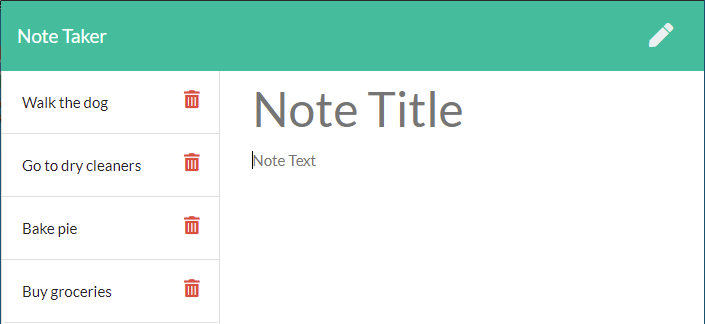
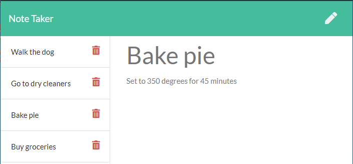

# Note Taker

## Description
    
This application uses an Express.js back end that allows users to write and save notes from a JSON file

## Table of Contents

* [Installation](#installation)
* [Usage](#usage)
* [Deployed Link](#deployed-link)
* [Preview](#preview)
* [Questions](#questions)

## Installation

[Node.js](https://nodejs.org/en/download/) is required. 

Run `npm i` to install the required npm packages

## Usage

Run `nodemon server.js` to start the application, then visit `http://localhost:3000/` in your browser to view the application. 

The left hand panel will show stored notes and click on it will display the contents on the right hand side. The delete button next to the note will remove it. Clicking the pencil icon on the top right will allow you to enter a new note and click the save button will store it.

## Deployed Link

https://note-taker-dtnguyen768.herokuapp.com/

## Preview

## Questions

If you have any questions, you can reach me through my github or email below

Github: [LinosM](https://github.com/LinosM)

Email: [NguyenDuy768@gmail.com](mailto:NguyenDuy768@gmail.com)